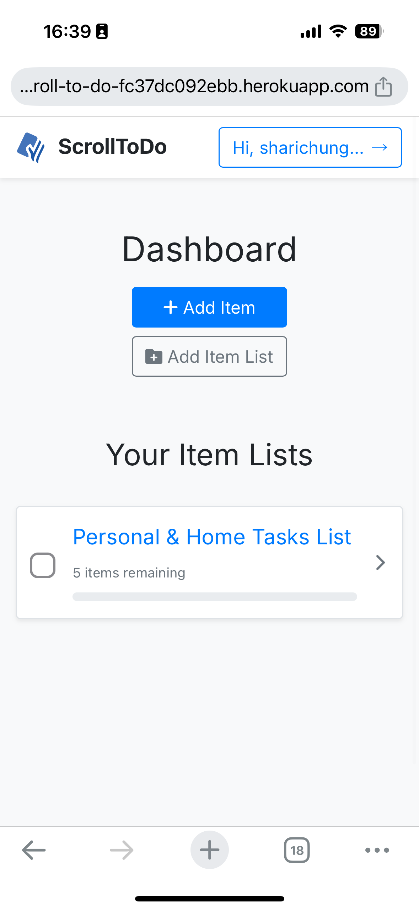
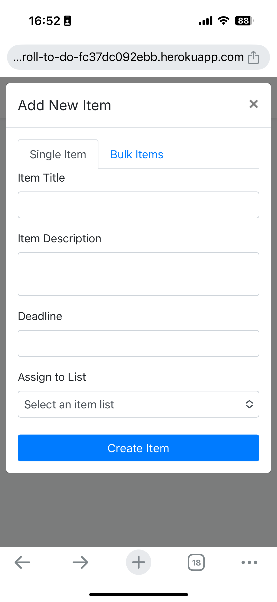
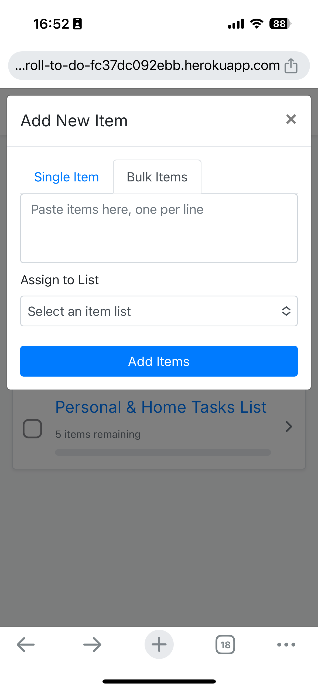
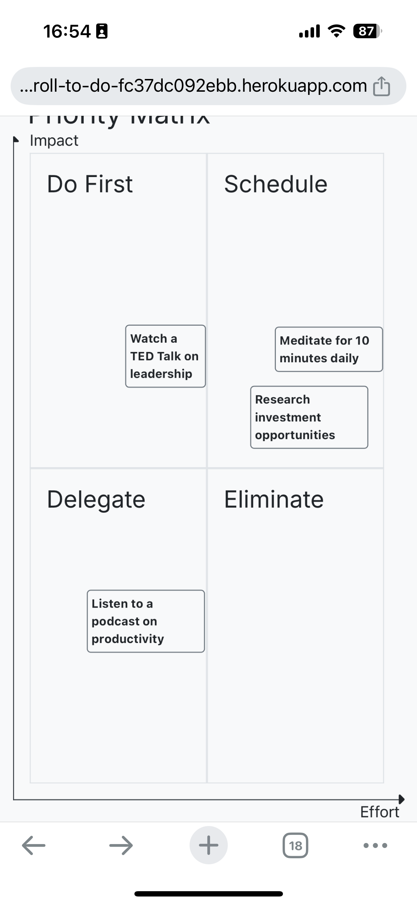

# ScrollToDo
ScrollToDo helps you effortlessly organize, prioritize, and conquer your tasks.

## Previous Version Screenshots

### Screenshot 1


### Screenshot 2


### Screenshot 3


### Screenshot 4


### Screenshot 5


[Deployed Website](https://scroll-to-do-fc37dc092ebb.herokuapp.com/)

## User Experience
### Purpose
- ScrollToDo is a task management tool designed for users to efficiently create, organize, and prioritize their tasks in an engaging way.
- It introduces an intuitive prioritization system that mimics the casual scrolling experience of social media, making task management more interactive and effortless.
- The target audience includes professionals, students, and anyone seeking an innovative way to manage tasks with a focus on prioritization.

## Agile Methodology
- Agile methodology was used to guide development, ensuring flexibility and iterative improvements.
- A project board was set up to track user stories, each assigned a 'MoSCoW' prioritization (Must have, Should have, Could have, Won't have).
- The project board can be found [here](https://github.com/users/sharichungcode/projects/3/).

### User Stories
1. **As a user, I can create tasks so that I can manage my to-do list efficiently.**
  - SUCCESS CRITERIA:
    - A simple input field allows task creation.
    - Tasks appear immediately in the list upon creation.

2. **As a user, I can prioritize tasks using a ranking system so that I can focus on what’s most important.**
  - SUCCESS CRITERIA:
    - Tasks can be ranked using drag-and-drop.
    - A matrix-based prioritization option allows sorting tasks into quadrants.

3. **As a user, I can prioritize tasks in a priority matrix format easily so that I can visually organize tasks by urgency and importance.**
  - SUCCESS CRITERIA:
    - Tasks can be dragged and dropped into a 2x2 priority matrix.
    - The matrix clearly distinguishes between urgent/important, urgent/not important, not urgent/important, and not urgent/not important tasks.

4. **As a user, I can track my progress so that I can monitor completed tasks.**
  - SUCCESS CRITERIA:
    - A checkbox allows users to mark tasks as completed.
    - Completed tasks are visually distinguished from active tasks.

5. **As a user, I can edit and delete tasks so that I can adjust my list as needed.**
  - SUCCESS CRITERIA:
    - Tasks can be edited in place.
    - Tasks can be removed from the list.

6. **As a user, I can view my tasks across devices so that I can access them anywhere.**
  - SUCCESS CRITERIA:
    - The app is fully responsive for mobile, tablet, and desktop.
    - Cloud-based storage ensures task persistence across sessions.

## Design
### Wireframes
- [Click here for design wireframe](#)

### Colour Scheme
- A modern, minimalistic theme with high-contrast colors for accessibility.
- A palette optimized for readability and ease of navigation.

### Typography
- Google Fonts were used to ensure readability and aesthetic appeal.
- A combination of sans-serif fonts was chosen for clarity and accessibility.

## Features
### Homepage
- The homepage serves as the central hub, displaying tasks in a clean, user-friendly interface.
- Users can easily add, edit, and delete tasks from this main view.

### Task Prioritization
- **Linear Ranking:** Drag-and-drop interface for ranking tasks.
- **Matrix Prioritization:** A 2x2 grid for sorting tasks based on urgency and importance.

### Progress Tracking
- Tasks can be marked as completed, providing a clear visual distinction.
- A simple analytics dashboard summarizes progress.

### Accessibility Features
- WCAG-compliant contrast levels.
- Keyboard navigability and screen-reader support.
- Large tap targets for mobile users.

## Database
- PostgreSQL was used as the database for storing user tasks securely.
- Entity-relationship diagrams (ERD) were created during the planning phase.

## Deployment
- **Platform:** Heroku
- **Deployment Steps:**
  1. Clone the repository.
  2. Install dependencies and set up the database.
  3. Deploy using GitHub integration.
  4. Ensure all environment variables are set correctly.
- Debug mode is disabled in production for security.

## AI Implementation and Orchestration
### Use Cases & Reflections
- **Code Creation:** AI-assisted development for rapid prototyping. AI helped speed up the process of creating database models by suggesting structure based on requirements.
- **Debugging:** AI-aided troubleshooting. AI assisted in identifying an issue with the model relationships, suggesting a fix that prevented database inconsistencies.
- **Performance Optimization:** AI-driven suggestions for speed and efficiency. AI suggested optimizing database queries, which resulted in a significant reduction in load time.
- **Automated Testing:** AI-generated unit tests with manual refinements. Copilot suggested test cases based on the application logic, which were then adjusted for accuracy.

### Insights into AI’s Impact on Workflow
- **Efficiency Gains:** AI improved the overall development process by saving time and providing useful suggestions that were not initially considered. This led to a more efficient and streamlined workflow.


## Testing
### Manual Testing
- **Devices & Browsers Tested:**
  - Chrome, Firefox, Safari, Edge
  - Mobile, tablet, and desktop responsiveness tested
  - Screen reader & keyboard navigation testing conducted
  - Task prioritization, user authentication

## Technologies Used
- **Frontend:** HTML, CSS, JavaScript, Bootstrap
- **Backend:** Python, Django
- **Database:** PostgreSQL
- **Hosting:** Heroku
- **Version Control:** GitHub

## System Requirements
- **Python Version:** 3.8 or higher
- **Required Packages:** Listed in `requirements.txt`

## Setting up the Application
1. **Clone the repository:**
   ```bash
   git clone https://github.com/sharichungcode/ScrollToDo.git
   cd ScrollToDo
   ```
2. **Install dependencies:**
   ```bash
   pip install -r requirements.txt
   ```
3. **Set up the database:**
   ```bash
   python manage.py migrate
   ```
4. **Run the server:**
   ```bash
   python manage.py runserver
   ```

## Deployment Process
### Heroku Deployment
1. **Set up the environment:**
   - Create a new Heroku app.
   - Set environment variables in the Heroku dashboard.
2. **Deployment commands:**
   ```bash
   heroku login
   heroku git:remote -a scroll-to-do
   git push heroku main
   ```
3. **Configuration:**
   - Ensure all necessary environment variables are set in Heroku.
   - Disable debug mode for production.

## Credits
- AI-assisted suggestions refined for UX and accessibility.
- Various online tutorials helped in implementing the prioritization logic.

## Acknowledgements
- Thanks to mentors and peers for feedback and testing contributions.
- Special thanks to the Code Institute community for insights and inspiration.
- Thanks to Spencer for fixing the "add new item and create a new list" function.
- Thanks to John for helping with fixing the modal form issue when opened with a button within the empty state.
- Thanks to Roo for helping with the 500 server error issue.